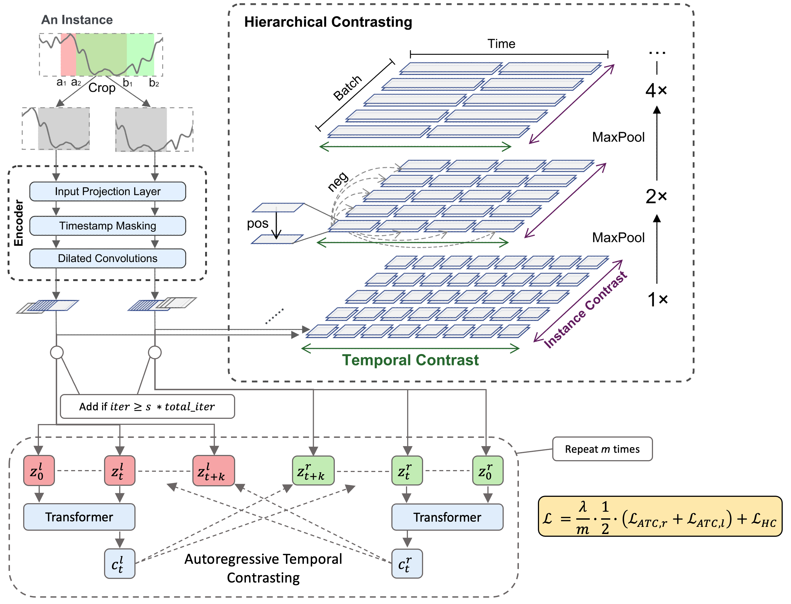

# TS2VecAR

This repo is the implemtation of the [TS2VecAR](https://github.com/constantin-crailsheim/TS2VecAR/tree/main/paper/misc/TS2VecAR.pdf) paper written in the Unsupervised Deep Learning Seminar at LMU Munich in the winter term 2022/23 under the supervision of [Dr. Mina Rezaei](https://www.slds.stat.uni-muenchen.de/people/minar/)

## Model structure

<p align="center">

</p>

## Experiments

### Hyperparameter

The recommended default hyperparameter are:

| Hyperparameter  | Value  |
|---|---|
| Total iterations | 600 |
| m  | 5  |
| \lambda  | 5  |
| k  | 10  |
| Context dimensions  | 100  |
| AR learning rate  | 3e-4  |
| AR weight decay  | 3e-4  |

### Results

# Setup

## Requirements

The recommended requirements can be installed with:

```(bash)
pip install -r requirements.txt
```

# Training

To train a model for a dataset use the following command, where further optional arguments can be added. 

```(bash)
python train.py <dataset> <run_name> --loader <loader_name>
```

To replicate the results of the paper run:

```(bash)
bash scripts/uea.sh
```


# Attribution

This implementation is mostly based on TS2Vec: https://github.com/yuezhihan/ts2vec.

The autoregressive model is based on TS-TCC: https://github.com/emadeldeen24/TS-TCC
