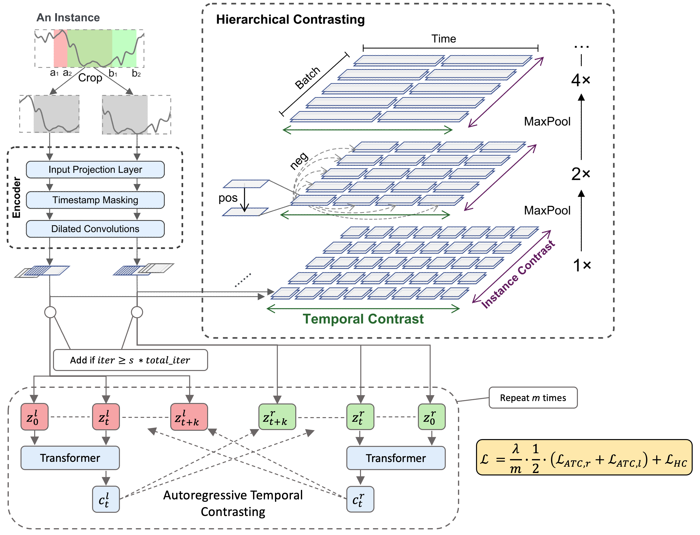

## TS2VecAR

This repo is the implemtation of the [TS2VecAR](https://github.com/constantin-crailsheim/TS2VecAR/tree/main/paper/TS2VecAR.pdf) paper written in the Unsupervised Deep Learning Seminar at LMU Munich in the winter term 2022/23 under the supervision of [Dr. Mina Rezaei](https://www.slds.stat.uni-muenchen.de/people/minar/)

# Model structure

<p align="center">

</p>

# Results

## Setup

# Requirements

The recommended requirements can be installed with:

```(bash)
pip install -r requirements.txt
```


## Training


```(bash)
python train.py <dataset> <run_name> --loader <loader_name>
```


## Attribution

This implementation is mostly based on TS2Vec: https://github.com/yuezhihan/ts2vec.

The autoregressive model is based on TS-TCC: https://github.com/emadeldeen24/TS-TCC
